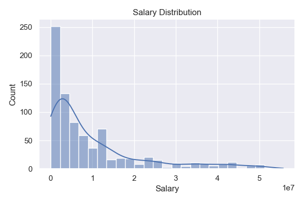
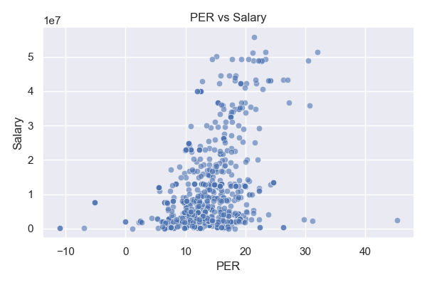

# NBA Player Performance vs Salary: Final Project Report

**Author:** Godwin Omowele  
**Date:** July 2025  

---

## 1. Introduction & Problem Statement

In this project, I wanted to find out if NBA teams are getting good value for the money they spend on players. Every season, teams pay hundreds of millions of dollars in salaries, but it’s not always clear which players are worth what they make. By comparing stats like points, rebounds, efficiency ratings, and minutes played with each player’s salary, I looked for players who are over-paid or under-paid. My goal was to give teams data-driven insights for contract talks, free-agent signings, and draft decisions.

---

## 2. Data & Wrangling

I used three main data sources:

- **Player stats** from Basketball Reference (per-game and advanced metrics).  
- **Salary data** from HoopsHype & Spotrac (2024–25 salaries).  

Here’s what I did to get the data ready:

1. Loaded all three CSV files into Pandas.  
2. Cleaned the salary columns by removing “\$” and commas and converted them to floats.  
3. Merged the stats and salary tables on the **Player** column (inner join).  
4. Dropped columns I didn’t need, like duplicate age/position fields and rank numbers.  
5. Saved the cleaned data as `data/merged_stats.csv`.

---

## 3. Exploratory Data Analysis

To understand how performance relates to pay, I created three key visuals:

1. **Salary Distribution**  
     
   Most players earn between \$2 M and \$8 M, with a long tail of superstars.

2. **PER vs Salary Scatterplot**  
     
   Shows a moderate positive correlation (r≈0.65), but also many over- and under-paid outliers.

3. **Correlation Heatmap**  
     
   Identifies which advanced metrics (e.g. BPM, Win Shares) align most strongly with salary.

---

## 4. Preprocessing

Before building models, I prepared the data like this:

- **Dummy features:** One-hot encoded all categorical columns (like position).  
- **Scaling:** Filled missing numeric values with the median, then applied a `StandardScaler` so each feature has mean 0 and variance 1.  
- **Train/Test split:** Split the data 75% for training and 25% for testing, using `random_state=42` for reproducibility.

---

## 5. Modeling & Metrics

I trained three regression models and evaluated them on the test set:

| Model               |       RMSE    |       MAE    |     R²    |
|:--------------------|--------------:|-------------:|----------:|
| Linear Regression   | 2.01×10¹⁶     | 3.99×10¹⁵    | –3.50×10¹⁸ |
| Random Forest       | 5.39×10⁶      | 3.15×10⁶     | 0.748     |
| XGBoost             | 5.11×10⁶      | 3.01×10⁶     | 0.774     |

I chose **XGBoost** as my final model because it had the lowest RMSE and the highest R².

---

## 6. Residual Analysis

I plotted the difference between actual and predicted salaries for XGBoost. The residuals are centered around zero and don’t show any clear patterns, which tells me the model is not systematically over- or under-predicting for certain players.

---

## 7. Conclusions & Next Steps

- **Key insight:** Performance and salary are fairly correlated (R²≈0.77), but there’s still about \$2–5 M of “value gap” for individual players.  
- **Recommendations:**  
  1. Identify the top 10 under-paid players (predicted salary > actual salary) and target them in contract talks.  
  2. Extend this analysis to cover multiple seasons to see long-term trends.  
  3. Incorporate playoff performance and injury history to improve salary predictions.  

Overall, this project shows how data science can help NBA teams make smarter financial decisions and find hidden value in their rosters.  
