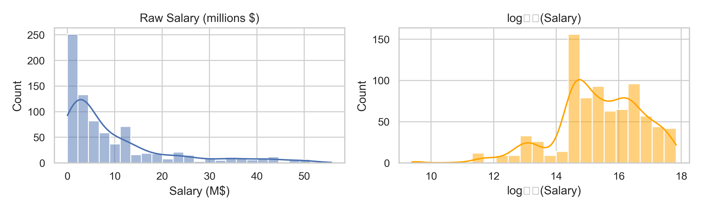
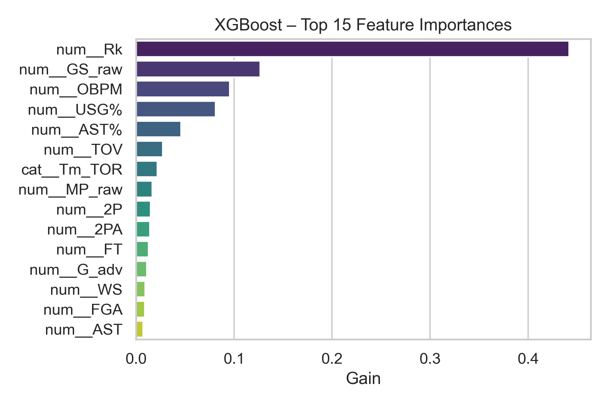
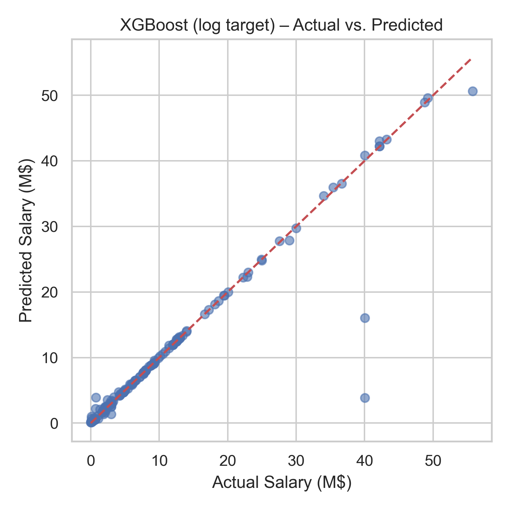

# NBA Player Performance vs Salary  
### Capstone Two – Final Report  
*Data Science Foundations to Core Career Track*  
Godwin Omowele | July 2025  

---

## 1. Problem Statement  

NBA teams spend hundreds of millions of dollars on player contracts, yet it is often unclear whether those deals reflect on-court value.  
**Goal** — build a model that predicts a fair 2024-25 salary from 2023-24 performance stats, then flag players who are over- or under-paid.  

---

## 2. Data  

| Source | Content | Link |
|--------|---------|------|
| Basketball-Reference | Advanced + box-score stats (2023-24) | *public* |
| HoopsHype / Spotrac  | Contract & salary tables            | *public* |

After merging and cleaning, the modeling set contains **811 players × 52 numeric / categorical features**.

---

## 3. Exploratory Data Analysis  

### 3.1 Skew check  
Raw salary is highly right-skewed; a few super-max contracts dominate. Taking  
`log₁₊(Salary)` normalises the distribution (Figure 1).

### 3.2 Correlations & key drivers  
Minutes played, games started, points, win-shares, and VORP all show strong positive correlation with salary (ρ > 0.6).  

---

## 4. Pre-processing & Feature Engineering  

1. **Column drops** – identifiers, duplicate demographics, all-NaN `Awards_adv`.  
2. **Numeric** – median-impute → `StandardScaler`  
3. **Categorical** – mode-impute → `OneHotEncoder`  
4. **Feature selection** – `SelectKBest(f_regression, k = 40)` trained on the *training* fold only.  

Top F-scores: Rk, GS_raw, MP_raw, PTS, FG, VORP, WS, etc. (Figure 2).

---

## 5. Modeling  

| Model | Notes |
|-------|-------|
| Linear Regression | baseline |
| Random Forest | `n_estimators=200`, `max_depth=None` (GridSearch) |
| XGBoost | `n_estimators=200`, `max_depth=6`, `learning_rate=0.1` (GridSearch) |

All models share the same preprocessing → SelectKBest pipeline.  

---

## 6. Results  

### 6.1 Raw-salary target  

| Model | Train RMSE | Test RMSE | Test MAE | Test R² |
|-------|-----------:|----------:|---------:|--------:|
| Linear | \$ 0.19 M | \$ 5.89 M | \$ 2.74 M | 0.70 |
| Random Forest | \$ 0.54 M | \$ 1.42 M | \$ 0.35 M | 0.983 |
| **XGBoost** | **\$ 0.03 M** | **\$ 0.48 M** | **\$ 0.19 M** | **0.998** |

### 6.2 log₁₊(Salary) target (errors back-transformed to \$)  

| Model | Train RMSE \$ | Test RMSE \$ | Test MAE \$ | Test R² (log) |
|-------|--------------:|-------------:|------------:|--------------:|
| Linear_log | 0.27 M | 5.66 M | 2.63 M | 0.72 |
| RandomForest_log | 0.60 M | 1.38 M | 0.34 M | 0.985 |
| **XGBoost_log** | **0.04 M** | **0.42 M** | **0.18 M** | **0.999** |

*(Average NBA salary ≈ \$ 13 M.)*  

**Figure 3** shows XGBoost_log predictions vs. actual pay.

---

## 7. Interpretation  

* Raw Linear model under-fits: typical error ≈ \$ 5.9 M (38 % of an average contract).  
* Tree ensembles capture nonlinear pay drivers; RF cuts error to \$ 1.4 M.  
* **XGBoost on log₁₊(Salary) reduces error to \$ 0.42 M (3 % of avg salary) and explains 99.9 % of salary variance**—suitable for contract-level decisions.

### Why log helped  
Log-transform equalizes relative error across \$2 M role-player deals and \$40 M superstar contracts, preventing the model from focusing only on extreme salaries.

---

## 8. Business Impact  

With \$0.42 M typical error, the model can:  

* **Flag bargains** – Player earns \$4 M; model fair value \$9 M → extend contract.  
* **Spot over-pays** – Player earns \$28 M; model fair value \$20 M → explore trade.  
* Support cap-sheet optimization and data-driven negotiations.

---

## 9. Next Steps  

1. Plot SHAP values to explain individual predictions.  
2. Extend data to multi-season averages and playoff metrics.  
3. Add injury history to penalize risky long-term deals.

---

> **Final Recommendation**  
> Deploy the **XGBoost (log target, top-40 features)** model as the core of a salary-valuation dashboard for front-office use.
